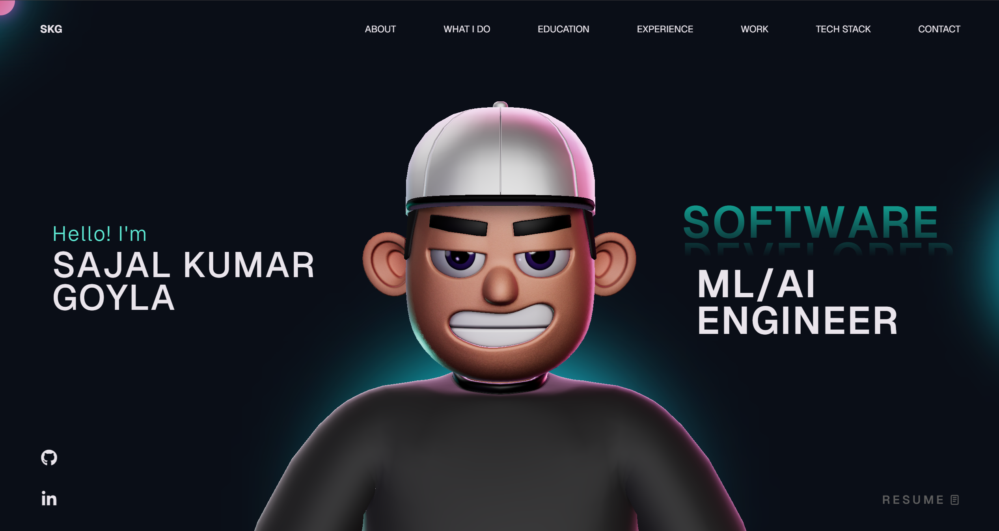

# 🌌 Sajal Kumar Goyla Portfolio



Welcome to my personal portfolio! This is a high-performance, interactive, and visually stunning web application built to showcase my work, skills, and experience.

### 🚀 [Live Demo: sajalgoyla.github.io](https://sajalgoyla.github.io)

---

## 🛠️ Tech Stack

This project leverages modern web technologies to deliver a premium user experience:

- **Frontend Framework**: [React 18](https://reactjs.org/) with [TypeScript](https://www.typescriptlang.org/)
- **Build Tool**: [Vite](https://vitejs.dev/) for lightning-fast development and builds
- **3D Engine**: [Three.js](https://threejs.org/) via [@react-three/fiber](https://docs.pmnd.rs/react-three-fiber/getting-started/introduction)
- **Physics**: [@react-three/rapier](https://github.com/pmndrs/react-three-rapier) for real-time 3D physics
- **Animations**: [GSAP (GreenSock)](https://greensock.com/) - utilizing `ScrollSmoother`, `ScrollTrigger`, and `SplitText` for silky-smooth interactions
- **Icons**: [React Icons](https://react-icons.github.io/react-icons/)
- **Deployment**: [GitHub Pages](https://pages.github.com/)

---

## ✨ Key Features

- **Interactive 3D Elements**: Integration of a 3D character model and physics-based environments using React Three Fiber and Rapier.
- **Ultra-Smooth Scrolling**: Powered by GSAP `ScrollSmoother` for a luxurious feel across all devices.
- **Dynamic Text Animations**: Complex text reveals and split-text effects using GSAP `SplitText`.
- **Responsive Navigation**: A sleek, mobile-friendly navigation system with smooth anchor links.
- **Modern UI/UX**: Dark-themed aesthetic with glassmorphism, vibrant gradients, and micro-animations.
- **Optimized Performance**: Lazy loading and code-splitting ensure fast load times.

---

## 📂 Project Structure

```text
├── src/
│   ├── Character/       # 3D Character models and logic
│   ├── components/      # Reusable UI and Layout components
│   ├── context/         # React Context for global state (e.g., Loading)
│   ├── styles/          # Plain CSS styling for maximum control
│   ├── utils/           # Animation helpers and GSAP configurations
│   ├── App.tsx          # Main entry point with Suspense & Lazy loading
│   └── main.tsx         # Root mounting
├── public/              # Static assets
└── vite.config.ts       # Vite project configuration
```

---

## 💻 Local Development

Follow these steps to get the project running locally on your machine:

1. **Clone the repository:**
   ```bash
   git clone https://github.com/sajalgoyla/sajalgoyla.github.io.git
   cd Portfolio
   ```

2. **Install dependencies:**
   ```bash
   npm install
   ```

3. **Start the development server:**
   ```bash
   npm run dev
   ```

4. **Build for production:**
   ```bash
   npm run build
   ```

---

## 📄 License

This project is licensed under the [MIT License](LICENSE).

---

Developed with ❤️ by [Sajal Kumar Goyla](https://github.com/sajalgoyla)